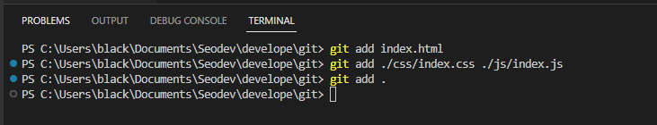
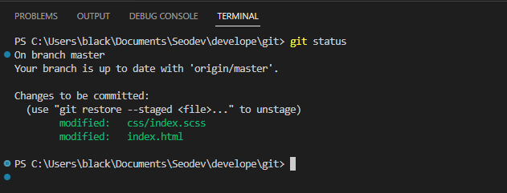
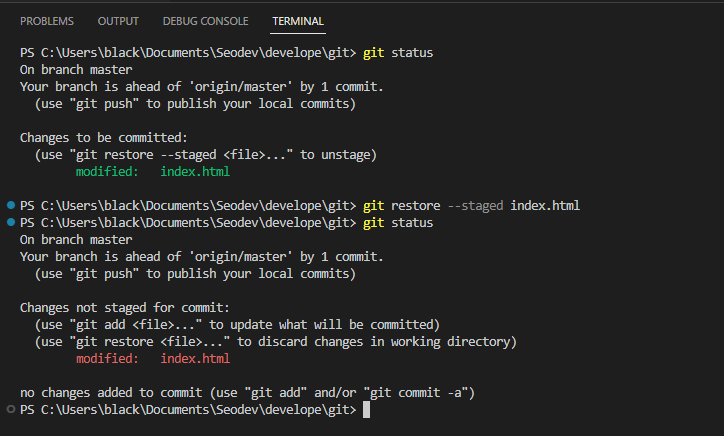
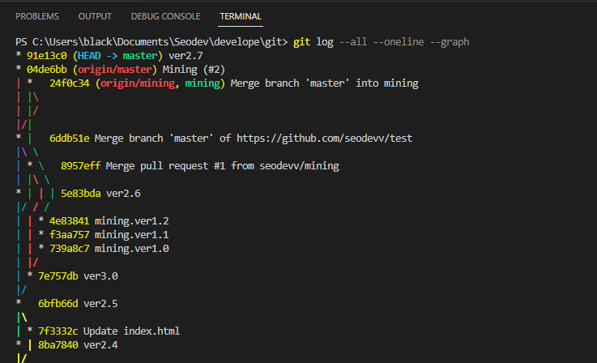

# git
+ 자주 사용하는 git command 를 정리

# structure


## git add
+ file 을 staging area 에 포함 시킨다.
```
> git add {fileName}
> git add {fileName1} {fileName2}
> git add .
```



## git commit
+ staging area 에 있는 file 을 repository 에 저장한다.
```
git commit -m 'message'
```


## git status
+ 현재 branch 위치 및 staging area 에 포함된 file 등의 status 를 보여준다.
```
git status
```



## git restore
+ staging area 에 포함되었던 file 을 제외시킨다.
```
git restore ---staged {fileName}
```



## status
+ branch, commit, merge 등의 정보를 담은 log 를 보여준다.
```
git log --all --oneline --graph
```

