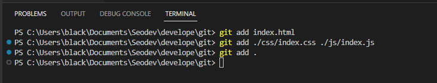
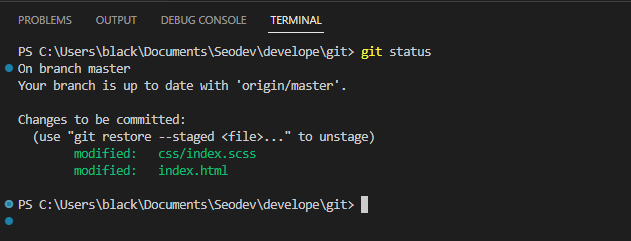
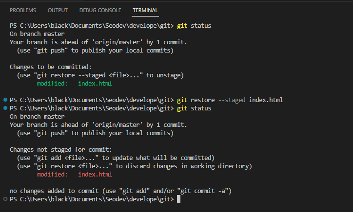
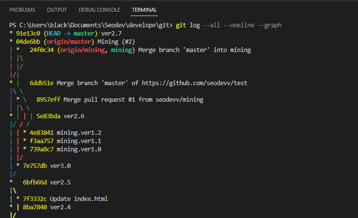
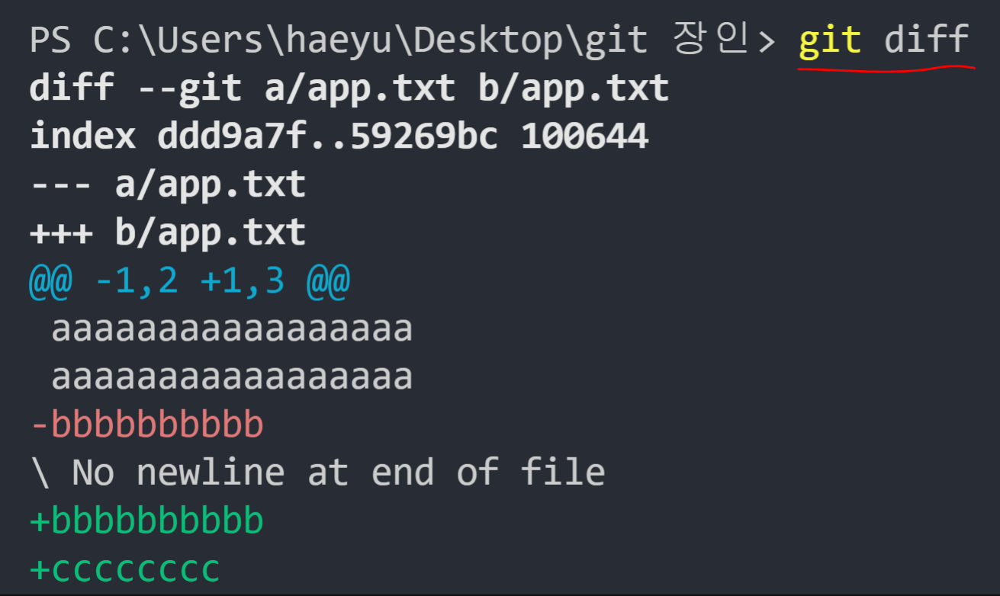
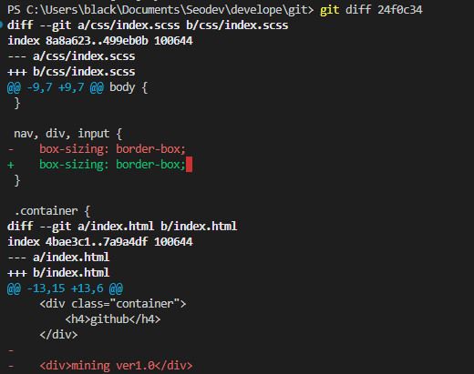
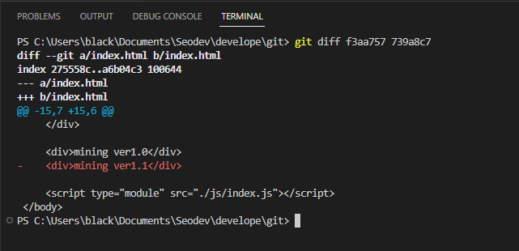
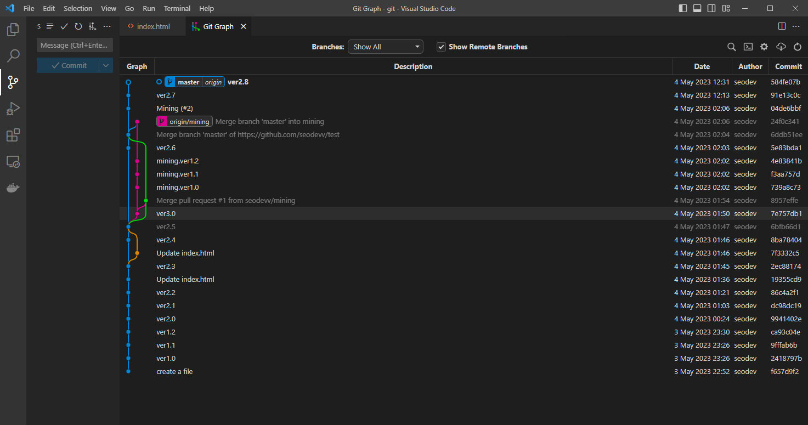

# git
+ 자주 사용하는 git command 를 정리

# structure


## git add
+ file 을 staging area 에 포함 시킨다.
```
git add {fileName}
git add {fileName1} {fileName2}
git add .
```



## git commit
+ staging area 에 있는 file 을 repository 에 저장한다.
```
git commit -m 'message'
```


## git status
+ 현재 branch 위치 및 staging area 에 포함된 file 등의 status 를 보여준다.
```
git status
```



## git restore
+ staging area 에 포함되었던 file 을 제외시킨다.
```
git restore ---staged {fileName}
```



## status
+ branch, commit, merge 등의 정보를 담은 log 를 보여준다.
```
git log --all --oneline --graph
```



## git diff / difftool
+ 현재 code 와 HEAD commit 파일과 compare 해서 보여준다.
+ difftool 을 뭔가... 잘 동작 안함 (확인해봐야 할 듯)
```
git diff
git difftool
```


```
git diff {commit_id}
git difftool {commit id}
```
+ 현재 code 와 특정 commit 파일과 compare 해서 보여준다.


```
git diff {commit_id} {commit_id}
git difftool {commit_id} {commit_id}
```
+ 특정 commit 파일끼리 compare 해서 보여준다.


## addons
+ vs code -> extension -> git Graph -> install

