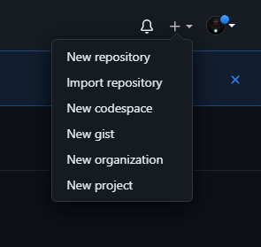
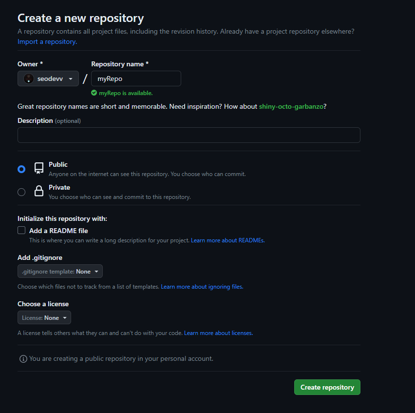
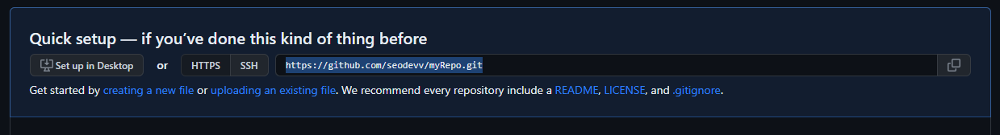
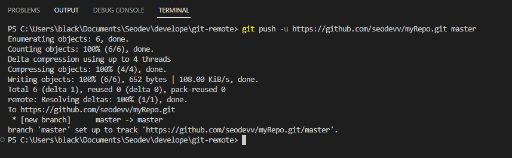
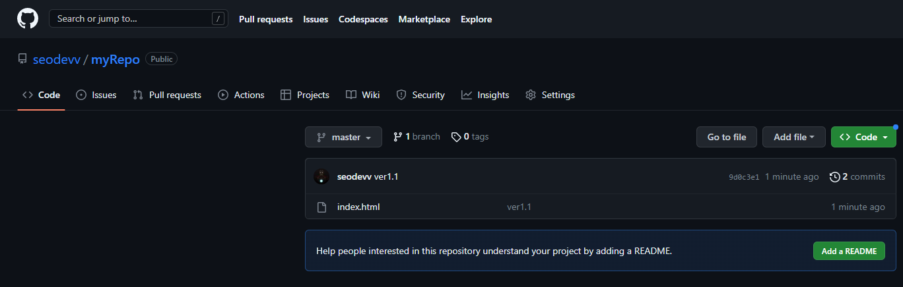
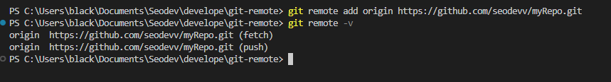
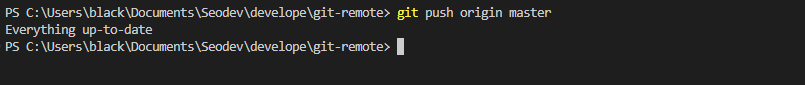
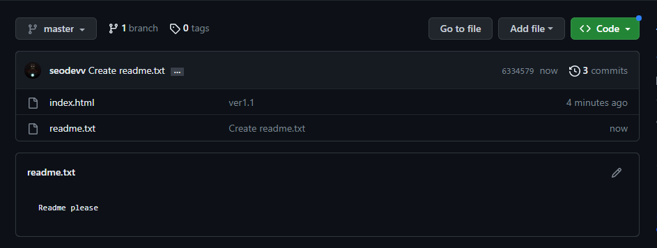
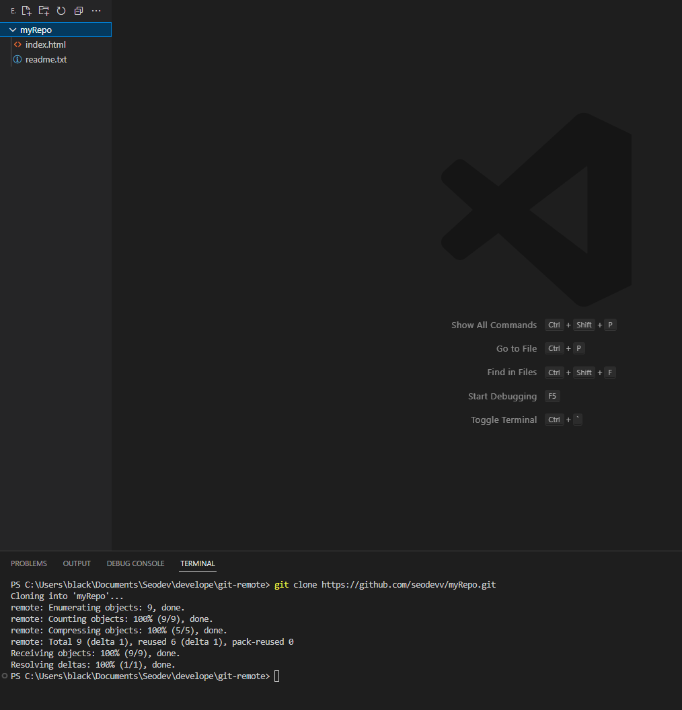

# Create github repository
1. git login

2. my repository

3. new repository


4. create repository


5. copy URL



# git push
+ git push -u ${URL} ${branch}
+ -u 옵션은 다음 번에도 해당 url 을 사용하겠다는 의미로
+ 다음 사용부터는 git push만 해도 동일한 url 로 push 된다.
```
git push -u https://github.com/seodevv/myRepo.git master
```



# git remote
+ 자주 사용하는 repository 를 변수(origin)로 등록
```
git remote add origin https://github.com/seodevv/myRepo.git
git remote -v
```


```
git push origin master
```


# git clone
+ 해당 repository 와 동기화 시킨다.
```
git clone ${URL}
```


```
git clone https://github.com/seodevv/myRepo.git
```


# .gitignore
+ .gitignore 파일을 통해 remote repository 에 업로드 되지 않을 파일을 결정한다.
