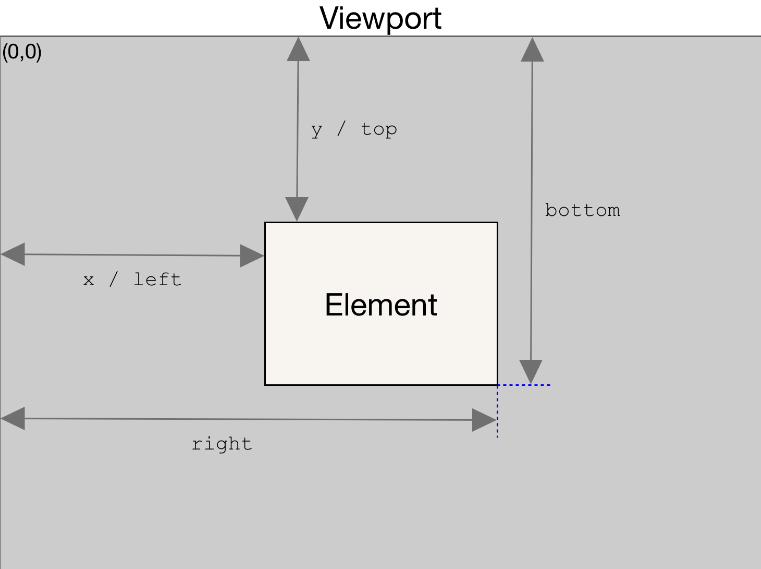

# scroll

## references
+ https://developer.mozilla.org/ko/docs/Web/API/Element/getBoundingClientRect

## getBoundingClientRect()



``` html
<div id="target"></div>
```

``` javascript
const target = document.querySelector('#target');
console.log(target.getBoundingClientRect());
```
> result
```
{
    "x": 379.09088134765625,
    "y": 160.1988525390625,
    "width": 300,
    "height": 561.9033813476562,
    "top": 160.1988525390625,
    "right": 679.0908813476562,
    "bottom": 722.1022338867188,
    "left": 379.09088134765625
}
```
