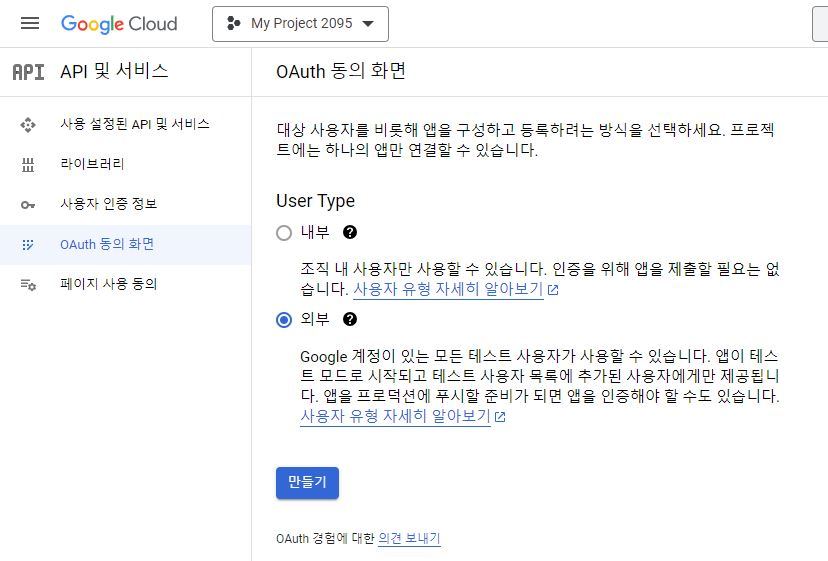
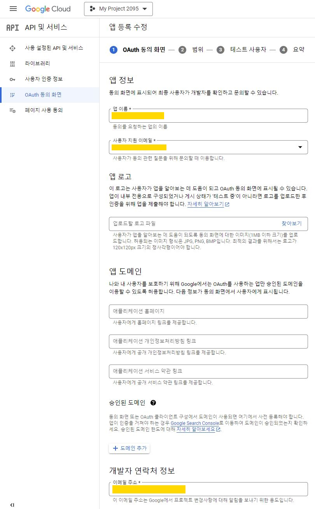
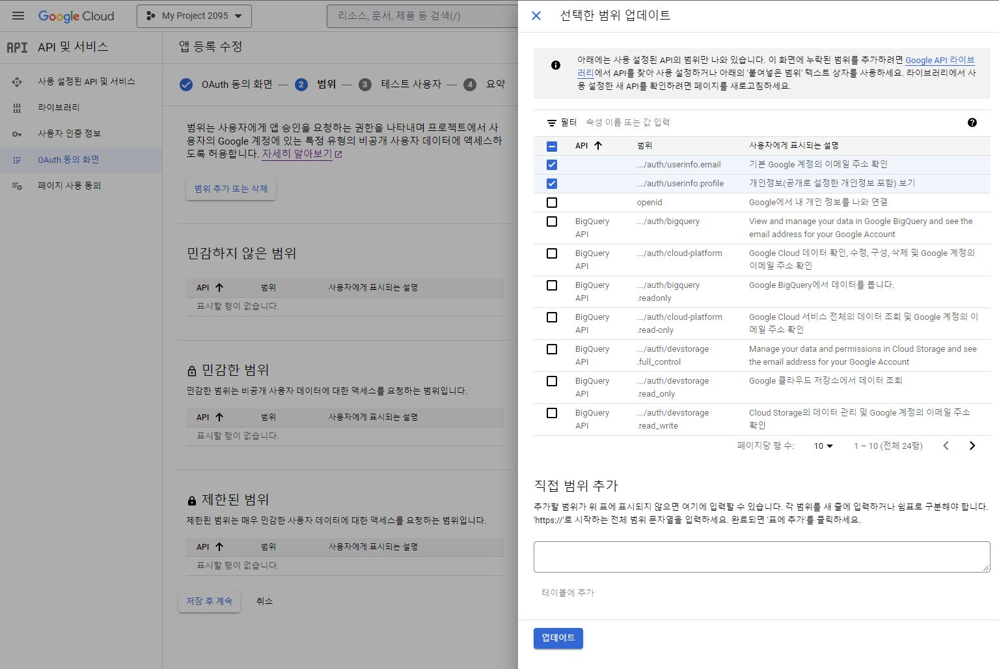
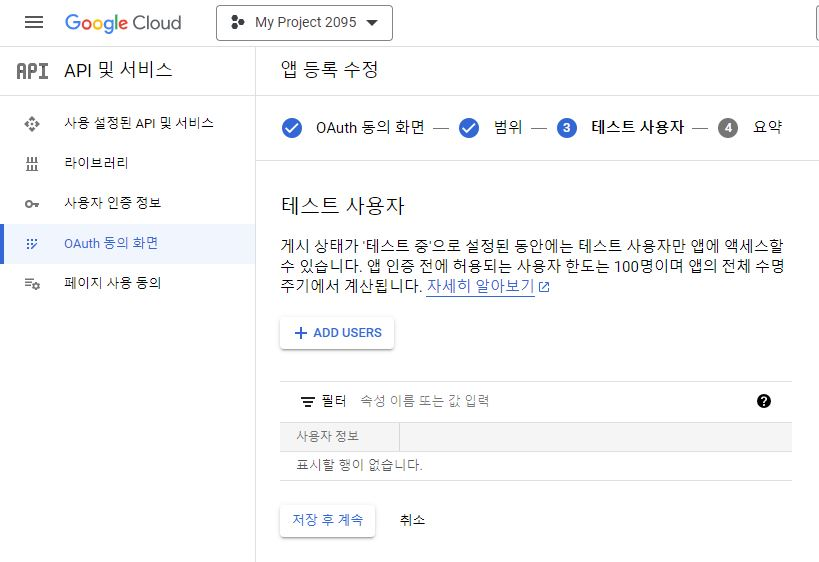
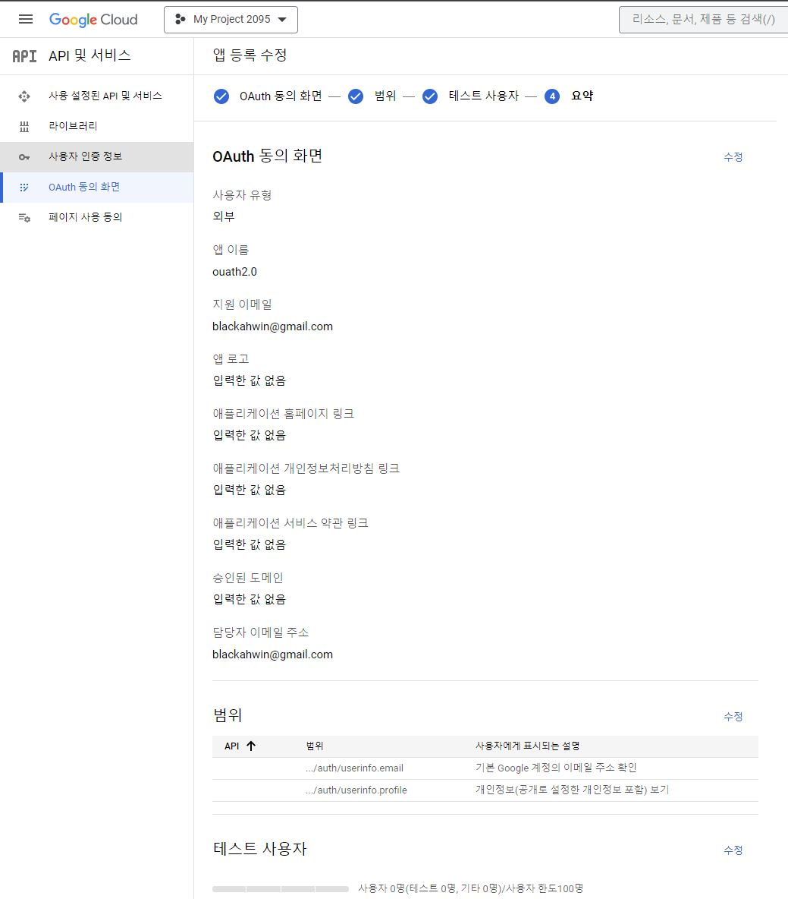
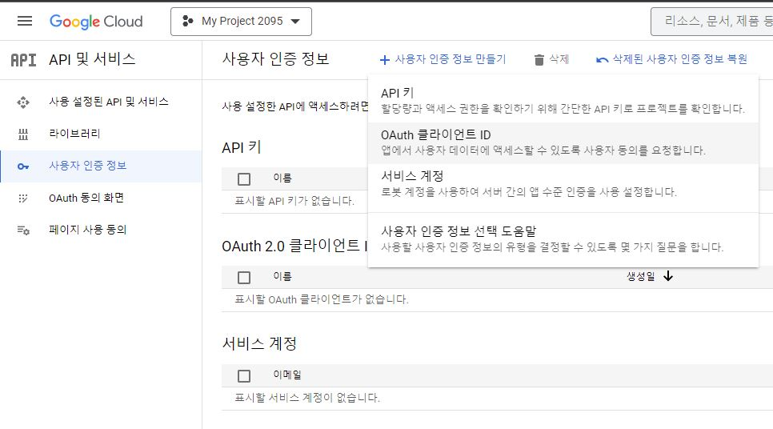
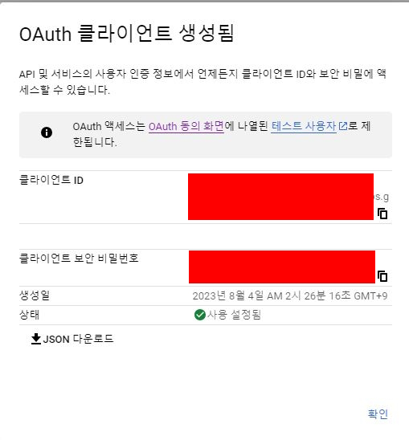

# @react-ouath/google
+ google 에서 제공하는 oauth 2.0 라이브러리
+ react 환경에서 사용이 간단하고 버튼 커스텀 또한 간단하여 사용하였음.

# reference
+ https://www.npmjs.com/package/@react-oauth/google
+ https://github.com/MomenSherif/react-oauth

# install
``` javascript
npm install @react-oauth/google@latest
```

# usage
1. create project (google cloud)
+ https://console.cloud.google.com/projectcreate
+ google oauth2.0 를 응답할 프로젝트(어플리케이션)를 생성한다.


> 본인은 모든 google 계정을 대상으로 사용할 것이기 때문에 "외부"로 설정해주었다.


> 앱 이름, 사용자 지원 이메일, 개발자 연락처 정보를 기입해준다.


> 사용자로부터 제공받을 정보의 범위를 설정한다.


> 테스트 사용자를 등록해준다. 본인은 설정하지 않았다.


> 요약 정보 확인


2. create client_id / client_secret
+ oauth2.0 사용할 때 필요한 client_id 와 client_secret 을 생성한다.

> 사용자 인증 정보 - 사용자 인증 정보 만들기 - Oauth 클라이언트 ID 를 클릭한다.


> 본인은 웹에서 사용하므로 웹 애플리케이션을 선택해주고, 요청할 host uri 와 callback 받을 uri 를 기입해준다.


> 그럼 이제 client_id 와 client_secret 가 발급된다.

