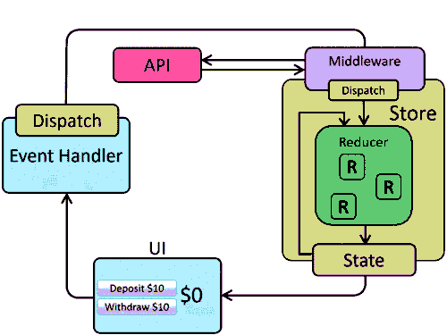
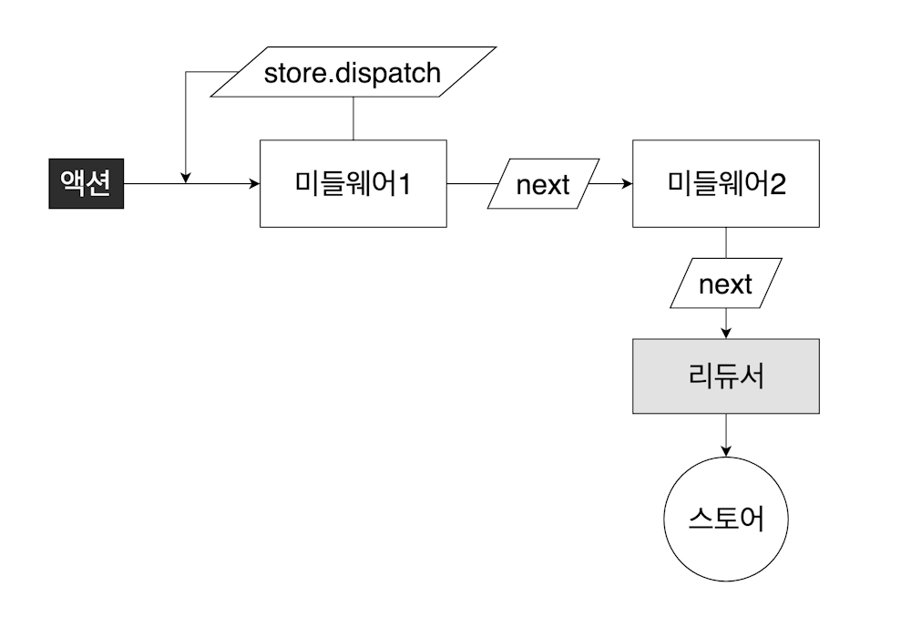

# redux
* state 를 global 하게 관리하기 위하여 나온 JS Library 이다.
* react 를 사용하다보면 state 를 props 로 여러 하위 컴포넌트를 거쳐 설정해주어야 하는 상황이 생기는데
* 다양한 성능 저하를 발생시키게 된다. (특히 렌더링 부분에서)
* 이를 global 하게 state 를 제공하여 각각 컴포넌트에 state 를 제공해주는 것이 바로 redux 이다.
```
npm i redux
```
* 보통 react 와 함께 쓰이긴 하나 여기에선 studey 의 목적으로 단일 redux 만을 소개한다.
> package.json
``` javascript
{
  "name": "redux",
  "version": "1.0.0",
  "description": "",
  "main": "index.js",
  "scripts": {
    "dev": "webpack serve --env development"
  },
  "author": "seodev",
  "license": "ISC",
  "dependencies": {
    "redux": "^4.2.1"
  }
}
```


---
## data flow
<p align="center"></p>

1. UI 에서 Event 가 발생하고, Dispatch 를 통해 action / thunk 가 store 에 전달된다.
2. Middleware 가 설정되있을 경우(thunk), dispatch 가 처리되기 전에 Middleware 를 처리한다. (위 사진에서는 서버와의 api 비동기 통신)
3. dispatch 에 담긴 action 이 정의된 reducer 를 통해 state 가 조작된 후 새로운 state 를 반환한다.
4. 새로이 반환된 state 를 통해 UI 를 re-rendering 한다.


---
## initialState
+ global 하게 사용할 state 의 초기값을 생성해준다.
+ reducer 가 분리될 경우 각각의 reducer 마다 initialState 를 지정해주어야 한다.
``` javascript
const initialState = {
  user: null,
  posts: [],
  isLoggedIn: false,
}
```


---
## reducer
+ action 에 따라 state 를 조작할 reducer 를 작성해준다.
+ reducer 는 항상 불변성을 지켜주어야 하므로 shallow copy 를 통해 항상 새로운 객체를 반환해준다.
  * spread syntax 를 주로 사용하며, 이것이 불편할 경우 immer library 를 사용하면 된다.
+ 실수를 방지하기 위해 꼭 default 를 설정해주는 것이 좋다. 
``` javascript
const reducer = (state, action) => {
  switch(action.type){
    case 'LOG_IN':{
      const { id, name, admin } = action.payload;
      return { ...state, user: { id, name, admin }, isLoggedIn: true };
    }
    case 'LOG_OUT':{
      return { ...state, user: null, isLoggedIn: false };
    }
    case 'ADD_POST':{
      const { userId, title, content } = action.payload;
      let nextId;
      if(state.posts.length === 0){
        nextId = 0;
      } else {
        nextId = Math.max(...state.posts.map(v => v.id)) + 1;
      }
      return { ...state , posts: [...state.posts, {id: nextId, userId, title, content} ] };
    }
    default:{
      return { ...state };
    }
  }
};
```


---
## createStore
+ 앞서 생성한 initialState, reducer 를 통해 store 를 생성해준다.
+ 생성한 store 는 react 에서 Provider 태그와 함께 컴포넌트에 state 를 제공해 줄 수 있다.
``` javascript
const store = createStore(reducer, initialState);
```


---
## dispatch
+ store 의 내장 함수 중 하나로, action을 인수로 담아 reducer를 실행시키는 함수이다
``` javascript
store.dispatch({
  type: "LOG_IN",
  payload: {
    id: 0,
    name: "seodev",
    admin: true,
  },
});
console.log("Action(LOG_IN):", store.getState());

store.dispatch({
  type: "ADD_POST",
  payload: {
    userId: 0,
    title: "Learning Redux",
    content: "Hello, Redux ?",
  },
});
console.log("Action(ADD_POST):", store.getState());

store.dispatch({
  type: "LOG_OUT",
});
console.log("Action(LOG_OUT):", store.getState());
```
> console
``` javascript
Action(LOG_IN): {
    "user": {
        "id": 0,
        "name": "seodev",
        "admin": true
    },
    "posts": [],
    "isLoggedIn": true
}
Action(ADD_POST): {
    "user": {
        "id": 0,
        "name": "seodev",
        "admin": true
    },
    "posts": [
        {
            "id": 0,
            "userId": 0,
            "title": "Learning Redux",
            "content": "Hello, Redux ?"
        }
    ],
    "isLoggedIn": true
}
Action(LOG_OUT): {
    "user": null,
    "posts": [
        {
            "id": 0,
            "userId": 0,
            "title": "Learning Redux",
            "content": "Hello, Redux ?"
        }
    ],
    "isLoggedIn": false
}
```


---
## subscribe
+ subscribe 또한 store 의 내장 함수 중 하나이다.
+ 함수를 인수로 가지며, action 이 dispatch 될 때마다 전달해준 함수가 호출된다.
+ react-redux 라는 Library 에서 connect, useSelector Hook 를 사용하기 때문에 보통 사용하지 않음
``` javascript
store.subscribe(() => {
  console.log('changed');
});

store.dispatch({
  type: "LOG_IN",
  payload: {
    id: 0,
    name: "seodev",
    admin: true,
  },
});
console.log("Action(LOG_IN):", store.getState());
```
> console
``` javascript
changed
Action(LOG_IN): {user: {…}, posts: Array(0)}
```


---
## combineReducers
+ action 들이 많아져 reducer 가 커지는 경우 reducer 를 분리해줄 수 있다.
+ 이 때, 분리된 reducer 들을 하나의 reducer 로 합쳐주는 함수가 combineReducers 이다.
+ reducer 가 분리되기 때문에 분리된 reducer 는 각각의 initialState 를 초기화 해주어야 한다.
> 폴더 구조
```
└ app
  └ store.js
└ reducers
  └ index.js
  └ user.js
  └ posts.js
└ 
```

> reducers/posts.js 
+ postsReducer 를 생성하여 export 한다.
``` javascript
const initialState = [];

const postsReducer = (state = initialState, action) => {
  switch (action.type) {
    case "ADD_POST": {
      const { userId, title, content } = action.payload;
      let nextId;
      if (state.length === 0) {
        nextId = 0;
      } else {
        nextId = Math.max(...state.map((v) => v.id)) + 1;
      }
      return [...state, { id: nextId, userId, title, content }];
    }
    default: {
      return [...state];
    }
  }
};

module.exports = postsReducer;
```


> reducers/user.js
+ userReducer 를 생성하여 export 한다.
``` javascript
const initialState = {
  isLoggedIn: false,
  data: null,
};

const userReducer = (state = initialState, action) => {
  switch (action.type) {
    case "LOG_IN": {
      const { id, name, admin } = action.payload;
      return { ...state, data: { id, name, admin }, isLoggedIn: true };
    }
    case "LOG_OUT": {
      return { ...state, data: null, isLoggedIn: false };
    }
    default: {
      return { ...state };
    }
  }
};

module.exports = userReducer;
```


> reducers/index.js
* combineReducers 를 통해 postsReducer, userReducer 들을 합친 후 export 한다.
``` javascript
const { combineReducers } = require("redux");
const userReducer = require("./user");
const postsReducer = require("./posts");

module.exports = combineReducers({
  user: userReducer,
  posts: postsReducer,
});
```


> app/store.js
* combineReudcers 로 합친 reducer 를 통해 store 를 생성한다.
``` javascript
const { createStore } = require("redux");
const reducer = require("../reducers");

const initialState = {
  user: {
    isLoggedIn: false,
    data: null,
  },
  posts: [],
  comments: [],
  favorites: [],
  history: [],
  likes: [],
  followers: [],
};

const store = createStore(reducer, initialState);

module.exports = store;
```


---
## middleware
+ action 이 dispatch 되기 전에 실행시키는 함수이다.
+ 주로 ajax 등의 ajax, logging, action cancle 등이 middleware 로 작성된다.
<p align="center"></p>
<p align="center">copyright: https://react.vlpt.us/redux-middleware/02-make-middleware.html</p>

+ createStore 를 정의해줄 때 3번째 인자로 enhancer 를 담는다.
+ enhancer 는 compose, applyMiddleware 등의 함수로 이루어진다.
+ compose 는 middleware 가 여러 개 일때, 합쳐주는 함수이고, applyMiddleware 함수는 하나의 미들웨어를 설정할 수 있다.
+ applyMiddleware 인수는 고차 함수로 생성한다.
  + store: 리덕스 스토어 인스턴스이다. dispatch, getState, subscribe 등의 내장 함수들을 갖는다.
  + next: action 을 다음 미들웨어에게 전달하는 함수이다. next(action) 이런 형태로 사용된다. (만약, 다음 미들웨어가 없다면 reducer 에게 액션을 전달해준다.)
  + action: 현재 처리하고 있는 action 객체이다.
``` javascript
const { createStore, compose, applyMiddleware } = require("redux");
const reducer = require("../reducers");

const initialState = {
  user: {
    isLoggedIn: false,
    data: null,
  },
  posts: [],
  comments: [],
  favorites: [],
  history: [],
  likes: [],
  followers: [],
};

const defaultMiddleware = (store) => (next) => (action) => {
  next(action);
};
const firstMiddleware = (store) => (next) => (action) => {
  console.log("store", store);
  console.log("next", next);
  console.log("action", action);
  // execute before dispatch
  next(action);
  // execute after dispatch
};
const enhancer = compose(
  applyMiddleware(firstMiddleware)
);

const store = createStore(reducer, initialState, enhancer);

module.exports = store;
```
* 작성된 defaultMiddleware 고차 함수는 dispatch 의 기본 동작과 동일하다.
* applyMiddleware(firstMiddleware) 를 설정했으므로 dispatch 가 되기 전 firstMiddleware 가 실행된다.
> console
``` javascript
store   {getState: ƒ, dispatch: ƒ}
next    ƒ dispatch(action) {
          if (!isPlainObject(action)) {
            throw new Error( false ? 0 : "Actions must be plain objects. Instead, the actual type was: '" + kindOf(action) + "'. You may need to add mid…
action  {type: 'LOG_IN', payload: {…}}
```
