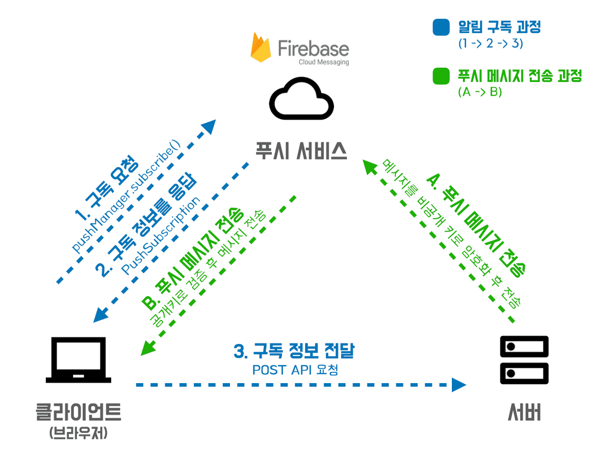

# web push
+ Notification, navigator, serviceWorker, web-push API 등을 사용하여 특정 Chrome client 에 push 알림을 보낼 수 있다.

# references
+ https://wonsss.github.io/PWA/web-push-notification/
+ 아주 정리가 잘 되어있다. 작성자 분께 감사드립니다.🙏

# structure

# API
+ Notification : 사용자에게 permission(알람 허용)을 요청하게 해주는 API
  + navigator : serviceWorker
